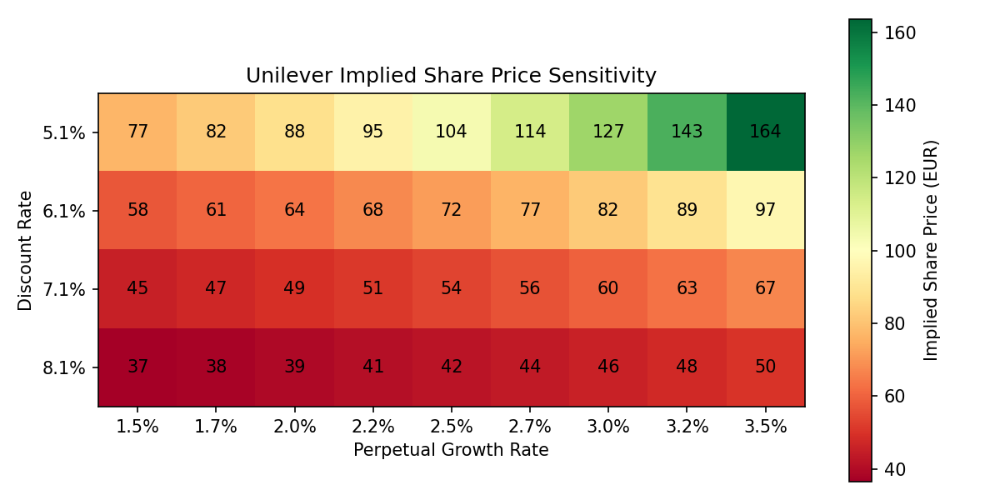

# DCF-Unilever
A Python based discounted cash flow (DCF) model estimating Unilever plc’s intrinsic share value. This model uses real sourced market data, rather than assumed figures, to calculate free cash flow projections, cost of capital (WACC) and terminal value.

## What the Model Does

- Initially, gathers all information from the sources to calculate the base discount rate, the WACC, using live market inputs: CAPM based cost of equity (risk free rate, beta, equity risk premium) and a credit rating derived cost of debt. I cross checked the credit rating against Unilver PLC 1.5% bond (ISIN: XS200892127, Düsseldorf Stock Exchange), yield to maturity 4.08% - 4.09%, via TradingView
- Then projects Unilever’s free cash flow over an 8 year future, using the company’s own reported underlying sales growth rate
-Discounts projected cash flows and a terminal value (Gordon Growth Model) to present value
-Includes a check that perpetual growth rate and discount rate don’t converge to guard against the Gordon Growth Model’s known instability.
- Outputs an implied share price and compares it against Unilever’s actual market price on the close of 4th September 2026
-Runs a full sensitivity analysis across a range of discount rates and perpetual growth rates, visualized as a labelled heat map. Discount rate range is centered on the model’s actual WACC, adjusted asymmetrically to maintain the minimum 0.5% buffer above the highest tested perpetual growth rate, preventing the model instability. Perpetual growth rate range is centered on the model’s base assumption (2% aligned with Bank of England’s inflation target), then widened to span the genuine methodological disagreement over whether Unilever is modeled as a UK mature market business or a global multinational earning the majority of its revenue in higher growth emerging markets

## Data Sources
- Unilever FY2025 Annual Report https://www.unilever.com/files/unilever-annual-report-and-accounts-2025.pdf
(Free Cash Flow, Net Debt, Underlying Sales Growth)
- Shares Outstanding https://companiesmarketcap.com/gbp/unilever/shares-outstanding/
- Shares Market price, 4th September 2026 close https://uk.finance.yahoo.com/quote/UNA.AS/
- Unilever Alphaspread https://www.alphaspread.com/security/lse/ulvr/discount-rate
(Cost of Equity, Risk-Free Rate, Beta, ERP)
- https://cbonds.com/news/3933801/ States the ’S&P Global Ratings affirmed Unilever at "A+”’  and from https://www.breckinridge.com/insights/q1-2026-corporate-bond-market-outlook/  the ‘A Index (+64bps) 4 bps tighter’ where 64 bps = 0.64%, therefore take 0.6 as credit spread.
- Gov UK, Corporation Tax https://www.gov.uk/government/publications/rates-and-allowances-corporation-tax/rates-and-allowances-corporation-tax
- Stable Growth Rate https://pages.stern.nyu.edu/~adamodar/New_Home_Page/valquestions/stablegrowthrate.htm?utm

## Assumptions and Simplifications

- Net Debt used in place for market value of debt. Finding the actual exact market value of Unilever’s total gross borrowings would require pricing each bond individually, net debt is a reasonable practical substitute.
- Cost of Debt (4.14%) is estimated from Unilever’s S&P A+ credit rating and a real A rated credit spread (0.64%), cross checked against the observed yield on an actual Unilever bond (4.09%).
- Perpetual growth rate range (1.5% - 3.5%) is deliberately wide. It reflects genuine disagreement over whether Unilever should be modeled as a UK mature market business or a global multinational earning the majority of it's revenue in higher growth emerging markets.
- A guard clause enforces a minimum 0.5% gap between the discount rate and perpetual growth rate in every calculation. This ensures the Gordon Growth Model does not become mathematically unstable as the two converge.

## Result

Base case implied share price: €63.81, versus Unilever's actual market price on the close of September 4th 2026: €55.48. This suggests the model's base case assumptions imply the market may be undervaluing the stock by roughly 15%.

But, this isn't a signal to buy on its own. A DCF's output is only as reliable as its assumptions. The sensitivity map below shows how much the implied share price moves across a reasonable range of discount rate and perpetual growth assumptions, from €37 to €164 depending on which end of the range used.



## How to Run
```bash
pip install numpy pandas matplotlib
python dcf_model.py
```
This prints the base case valuation and the full sensitivity table to the console.

## Possible extensions 
- Pull financial data automatically via an API (for example 'yfinance')
- Use a longer dated Unilever bond for a more precise cost of debt (the one used matures in under a year)
- Model FCF growth by business segment rather than a blended rate.

